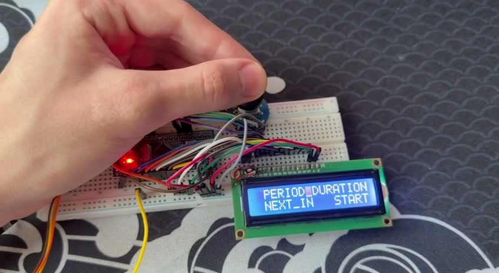

# STM32 Greenhouse User Interface Display

[Русский](README.md) · **English**

A display for interacting with a greenhouse, built on **STM32F103C8T6** with a character LCD, rotary-encoder menu, configurable intervals and a countdown.

[Watch the demo — 43 seconds, silent MP4](media/demo.mp4)

## Features

- Custom LCD functions using an 8-bit parallel interface: initialization, commands, text and cursor control.
- Encoder navigation through `PERIOD`, `DURATION`, `NEXT_IN` and `START`.
- Period setting in hours; duration and initial-delay settings in minutes.
- Countdown display with button cancellation.
- Hardware encoder decoding using TIM4 encoder interface mode.

## My contribution

I built this educational project independently: connected the LCD and encoder, wrote the display functions and menu/timer logic, and configured the peripherals in STM32CubeMX. The project uses STM32 HAL; it does not use a ready-made LCD library.

## Connections

| Signal | STM32 pin |
|---|---|
| LCD D0–D7 | PA0–PA7 |
| LCD RS / RW / E | PA8 / PA9 / PA10 |
| Encoder button | PB5 |
| Encoder A / B | PB6 / PB7 — TIM4 CH1 / CH2 |

This table comes from the source code and CubeMX configuration. Exact board/LCD/encoder models, power wiring, contrast adjustment and external pull resistors are not yet documented; it is not a complete wiring diagram.

## Structure and operation

- `Core/Src/main.c`: initialization, menu selection and countdown sequencing.
- `MDK-ARM/lcd_functions.c` and `.h`: LCD control, button handling, value editing and countdown.
- `polivka.ioc`: CubeMX configuration.
- `MDK-ARM/polivka.uvprojx`: Keil µVision project.
- `Drivers/`: STM32 HAL sources used by this build and the required CMSIS headers.

The encoder position is read from TIM4. The countdown uses software delays via `HAL_Delay`; TIM4 is used for the encoder. LCD control combines HAL calls with direct GPIOA register writes.

## Build

Toolchain: **Arm Compiler 6.22**, **Keil.STM32F1xx_DFP 2.4.1**. The `.ioc` specifies **STM32Cube FW_F1 V1.8.7**.

1. Clone the repository and preserve its directory structure.
2. Open `MDK-ARM/polivka.uvprojx` in Keil µVision with Arm Compiler 6.22 and the device pack above.
3. Run **Rebuild**. CubeMX regeneration is not needed to build the saved project.

Outputs are created in `MDK-ARM/polivka/` and excluded from Git. Dependencies are the subset needed by this project, not the complete Cube distribution. Configuration changes/regeneration require the corresponding CubeMX package.

## Demo and validation

The video shows the display, menu, value editing and an active countdown.

Build on September 10, 2026: **0 errors, 0 warnings**. Details: [VALIDATION.md](VALIDATION.md).

## Known limitations

- Turning the encoder backwards past zero can produce values around 16383, visible in the demo. Editing bounds are not enforced.
- `period` and `duration` are `uint8_t`, while the editor returns `uint16_t`; large values are truncated when saved.
- The blocking countdown includes delays and LCD update time. Long-interval timing accuracy has not been measured.
- Settings do not survive power loss.

## Components and attribution

Project author: [NOVA2270](https://github.com/NOVA2270). STM32 HAL/CMSIS copyright and license notices are retained in the relevant source and component files. See [THIRD_PARTY_NOTICES.md](THIRD_PARTY_NOTICES.md).
